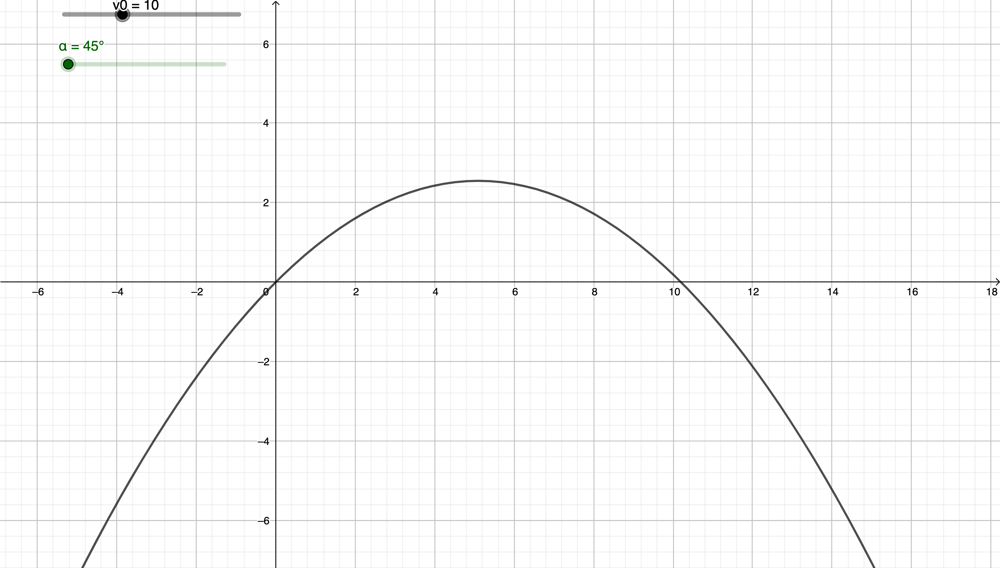

# 
Balistique

## 1] Contexte

Une pierre a été retrouvée à l’intérieur de l’appartement de M. Gerard Manfin. La pierre a-t-elle pu être envoyée de l’extérieur ?  

## 2] Étude physique (paramétrage) et mise en équation

L’appartement de M. Manfin se trouve au troisième étage de l’immeuble, à une hauteur de 9 m.  Devant l’immeuble se trouve une haie de 1 m de haut, si bien qu’il n’est pas possible de s’approcher  à moins de 1,50 m de l’immeuble.  

1. Faire un schéma à l’échelle de la situation. On prendra pour cela un homme de taille moyenne  de 1,7 m.  On souhaite ensuite paramétrer le mouvement de la pierre, c’est-à-dire modifier les caractéristiques du mouvement. Pour cela, on ajoute un repère (appelé "référentiel" en physique) pour  repérer la position (x ; y) de la pierre à chaque instant. On choisira comme origine O des axes l’endroit où le lancer lâche la pierre. On ajoutera un axe (Ox) horizontal et un axe (Oy) vertical.  

2. Ajouter ce repère au schéma précédent.  

3. Quels sont selon vous les paramètres qui vont influencer la trajectoire de la pierre ?  On vérifiera  ces hypothèses dans la partie mathématique.  En utilisant les lois de la physique, on trouve l’expression des coordonnées (x, y) de la pierre  en fonction du temps t :  
   
   $$x = v_0 \times cos(\alpha) \times t $$
   
   $$ y = −\dfrac{1}{2}\times g \times t^{2} + v0 ×sin(\alpha) \times t $$
   
   et où g = 9,81 m.s2 est une constante, $v_0$ la vitesse initiale et α l’angle avec lequel a été lancé la pierre.  

## 3] Étude mathématique de l’équation

   Pour pouvoir tracer la trajectoire, il faut une expression où y est exprimée en fonction de x :  

1. A l’aide de la première équation physique, exprimer t en fonction de x.  

2. Remplacer t par l’expression trouvée, dans la seconde équation, pour obtenir :  
   
   $$ y = − \dfrac{g}{2v_0 ^{2}} \times cos(\alpha)^{2} + tan(\alpha) \times x
   $$

L’équation obtenue est celle d’une fonction dite "trinôme du second degré". L’allure générale de ce type de courbe est une parabole, comme pour la fonction carré, mais à "l’envers".  

3. Dessiner au crayon de papier l’allure de cette trajectoire sur votre schéma, placer l’angle α. Les questions suivantes servent à vérifier votre intuition.  

4. Tracé sur GeoGebra  
   
      a. Créer une constante $g = 9,81 m.s^{-2}$ en entrant simplement cette égalité dans la ligne de saisie ;  
   
      b. Créer deux curseurs appelés $\alpha$ et $v_0$ correspondant respectivement à l’angle de lancer et la vitesse initiale fournie à la pierre. (largeur des curseurs : 400) ;  
   
      c. Entrer l’équation obtenue en 2 dans la ligne de saisie et régler le zoom pour n’afficher que la partie de la courbe qui est au-dessus de l’axe des abscisses.  

5. Influence de l’angle initial  
       a. On fixe une vitesse initiale de 15 $ m.s^{-1}$. Tracer les trajectoires correspondant à des angles de lancer de 30°, 40°, 45°, 55°;  
   
      b.  L’angle initial a -t-il une influence sur la distance ?  
   
      c. On suppose la pierre lancée avec une vitesse initiale de 10 $m.s^{-1}$. Sous quel angle la lancer pour qu’elle aille le plus loin possible ? Le plus haut possible ?  

6. Influence des autres paramètres  
   1. Comment déterminer l’influence de la vitesse initiale ?  
   
   2. D’après les équations, la masse a-t-elle une influence ?  
   
   3. D’après les équations, la force a-t-elle une influence ?  

7. Des trajectoires particulières  
   
   1. Tracer les trajectoires correspondant à des angles de lancer de 30°et de 60°, avec une même vitesse initiale de 15 $m.s^{-1}$ ;  
   
   2. Que remarque-t-on ?  
   
   3. Et pour un angle de 20°? de 40°?  

8. Monsieur Manfin habite au troisième étage, à 9 m de hauteur. Proposer à l’aide de GeoGebra des angles et vitesses initiales permettant d’envoyer la pierre à cette hauteur.  

9. Un être humain moyen peut fournir une vitesse initiale maximale d’environ 12 m.s-1 (le record du monde étant de 14 m.s-1). Conclure quant à la plausibilité que la pierre ait été lancée de l’extérieur par la fenêtre.  

10.  Proposer des hypothèses sur la présence de la pierre retrouvées.
