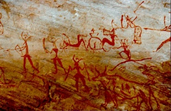

# Les pigments

## 1) Les différentes techniques de peinture

Les peintures sont des représentations du monde. Elles sont les
résultats d'une multitude d'évènements tels que les évènements
historiques, les phénomènes de société, les cultures religieuses,
spirituelles et les tendances philosophiques.

Dès le paléolithique il existe des représentations picturales ; elles
sont le résultat de l'association des différentes argiles de couleurs,
de cendres d'os, de pigments végétaux associés à de l'eau ou de la
graisse.

Dans l'Antiquité, les pigments sont le plus souvent d'origine minérale.
Les nuances sont obtenues par chauffage et mélange des différentes
teintes. Les peintures sont plutôt murales mais de nombreux objets
parchemins, vêtements sont teintés.

Au moyen âge, les techniques sont complexes, les peintures murales sont
faites à sec ou bien à fresques. La peinture sur bois est une révolution
très prisée car elle permet la circulation des œuvres. Les objets ainsi
réalisés peuvent être embellis et enrichis par des couches de feuilles
d'or. C'est le cas pour les icônes et les retables.

A la fin du XVIème siècle, la pratique dominante est la tempera. Il
s'agit d'un mélange de colle ou d'eau et de pigments. Cette peinture est
sensible aux variations de température et d'humidité. L'œuf est rajouté,
il donne l'éclat aux couleurs et à l'émulsion. Les couleurs de la
tempera sont mates..

L'aquarelle est utilisée à la Renaissance. Elle correspond à une
détrempe très légère. La gouache est une tempera beaucoup plus pâteuse.
Le pastel (associé aux accessoires du dessin, fusain, craie, sanguine)
est broyé avec les pigments de couleurs. Le diluant étant l'eau.

Les fresques très présentes dans toute l'histoire de la peinture sont
codifiées. Les pigments de terre et d'origine végétale sont dilués dans
de l'eau et déposés sur un mortier de chaux éteinte, ils seront ensuite
étendus. Les teintes obtenues seront le résultat de réaction entre la
chaux et les pigments. Le mortier va absorber et fixer les cou

La peinture à l'huile est une nouveauté, elle fut travaillée dans les
Flandres et en Italie. La technique finale apparaîtra à la fin du XVème
siècle. Les recettes sont innombrables, elles font intervenir l'œuf,
l'huile, le vernis. Les huiles utilisées sont l'essence de térébenthine,
de lavande, de lin, de pavot, de ricin. Les supports sont nombreux ; ils
peuvent être composés d'une toile de lin ou de chanvre tendue sur un
châssis, mais aussi sur de la pierre, du cuivre, de l'ardoise \...Il est
possible de travailler sur un fond préalablement coloré. C'est le cas de
la technique de l'imprimitura.

Les techniques synthétiques se sont développées depuis la seconde guerre
mondiale. Les peintures sont plus complexes. L'utilisation de matières
plastiques, la stabilité des couleurs, ont permis une popularisation de
la peinture et de diversifier encore plus les supports picturaux.

D'après <http://www.pigmentplus.com/histoiredupigment.html>

 

## 2) La conservation des fresques de Pompéï

L'assombrissement, jusqu'à devenir gris-noir, de la couleur écarlate du
cinabre sous l'influence du rayonnement solaire constitue une importante
problématique de conservation des peintures murales depuis l'antiquité
et jusqu'à nos jours. Actuellement, le noircissement des fresques de la
villa des Mystères à Pompéi en est la parfaite illustration.

::

Vitruve (architecte romain qui vécut au premier siècle après J.C)
explique que : « Lorsqu'il est employé dans les appartements dont les
enduits sont à couvert, le cinabre conserve sa couleur sans altération ;
mais dans les lieux exposés à l'air, comme les péristyles, les exèdres,
et quelques autres endroits semblables où peuvent pénétrer les rayons du
soleil et l'éclat de la lune, il s'altère, il perd la vivacité de sa
couleur, il se noircit aussitôt qu'il en est frappé ». Ce dernier
mentionne que de la cire aurait été appliquée sur les peintures murales
pour empêcher que la lumière de la lune et les rayons du soleil n'en
enlèvent la couleur ; mais certains facteurs associés accélèrent ce
changement chromatique, comme une forte humidité associée à une
atmosphère fortement polluée. Seule la surface est dégradée, si elle est
grattée, on peut apercevoir à nouveau la couleur rouge. Cette
dégradation spécifique au cinabre rouge peut aussi permettre son
identification.

*D'après Wikipédia.*

**Question :** D'après le texte ci-dessus, quels sont les paramètres qui
peuvent altérer les peintures ?

### 2.1) Influence de la lumière

**Expérience :**

Dans une coupelle contenant de la solution de chlorure de sodium,
ajouter une solution de nitrate d'argent.

**Observer**

Laisser reposer la coupelle à la lumière du jour. Observer.

### 2.2) Influence de l'humidité

**Expérience :**

Ajouter quelques gouttes d'eau distillée sur du sulfate de cuivre
anhydre contenu dans une coupelle.

**Observer :**

### 2.3 Influence de la température

**Expérience :**

Dans un tube à essais contenant quelques mL d'éthanol, ajouter une
petite spatule de chlorure de cobalt.

Mélanger à l'aide d'une tige de verre pour homogénéiser.

**Observer.**

Ajouter de l'eau distillée.

**Observer.**

En le tenant à l'aide d'une pince de bois, chauffer le tube à essais sur
un bec électrique.

**Observer.**

Après léger refroidissement et avec précaution, immerger le tube à
essais dans un bain eau-glace. Observer.

### 2.4) Influence de l'acidité

**Expérience :**

On dispose de jus de chou rouge obtenu par cuisson de chou dans de
l'eau, d'une solution d'acide chlorhydrique à 0,1 mol.L, d'une solution
de soude à 0,5 mol.L et d'eau de Volvic.

A l'aide de burettes graduées, réaliser les mélange suivants dans des
tubes à essais puis compléter la ligne pH et conclure.

**Rappel :**

- Si pH \< 7 : la solution est acide ;

- Si pH = 7 : la solution est neutre ;

- Si pH \> 7 : la solution est basique.

## 3) Dans les musées\...

Dans quasiment tous les musées, les œuvres d'art et en particulier les
peintures sont exposées dans des conditions très strictes. Le degré
d'hygrométrie ainsi que la température sont surveillées, l'air est
filtré pour éviter toute pollution extérieure, il y a très peu de
lumière directe du jour et les photographies au flash sont interdites.
Il faut en fait surtout éviter les variations de ces différents
paramètres.

Taux idéal d'humidité relative : 50 à 60%

Température idéale : entre 18 et 20° C

Par exemple, la Joconde est conservée à 19° et 55% d'Hr.

## 4) Une nouvelle technique de dessin : le feutre

### 4.1) Le feutre

Bien souvent, les premiers dessins réalisés par les enfants sont
exécutés à l'aide de feutres. L'avantage du feutre est qu'il laisse sur
le papier une trace très colorée et qu'on le trouve dans une multitude
de couleurs. La technique du dessin aux feutres n'est pas réservée
seulement aux enfants, elle est aussi utilisée par les plasticiens et
les graphistes.

L'invention du stylo-feutre revient à la société japonaise qui le
commercialisa en 1963. Nous avons vu que qu'au cours de l'histoire, les
artistes ont soit utilisé des matières colorantes pures soit des
mélanges de matières colorantes pour créer leurs œuvres. Lorsque nous
traçons une figure à l'aide d'un feutre, utilisons-nous une encre
constituée d'un pigment ou d'un mélange de pigments ?

Pour répondre à cette question, nous allons réaliser une
chromatographie.

### 4.2) Expérience et analyse

**Protocole :**

- Fermer la cuve à chromatographie afin que l'intérieur de la cuve se
  sature en vapeurs de l'éluant.

- Sur une plaque pour chromatographie (feuille d'aluminium recouverte
  de silice poreuse), tracer au crayon de papier un trait léger à
  environ 2 cm du bas de la feuille et y repérer 4 points
  équidistants.

- Sur ces quatre points, faire une trace avec les feutres noir, bleu,
  jaune et rouge.

- Déposer alors la plaque dans la cuve de manière à ce qu'elle trempe
  dans l'éluant mais en veillant bien à ce que les 4 taches ne soient
  pas immergées.

- Attendre que le niveau de l'éluant arrive à environ 2 cm du haut de
  la plaque. Sortir alors le chromatogramme et y repérer, au crayon de
  papier, le niveau atteint par le front de l'éluant.

- Sécher la plaque à chromatographie en l'agitant.

**Question**:

Comment est constituée l'encre noire ?
